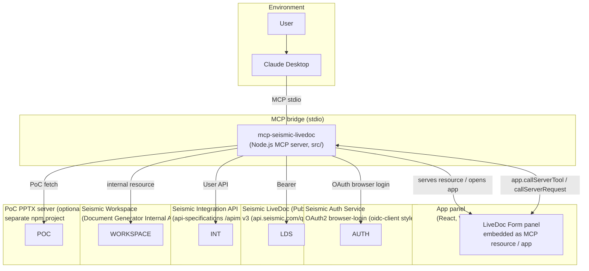

# mcp-seismic-livedoc — High-Level Architecture

The **mcp-seismic-livedoc** project is a **Model Context Protocol (MCP) server** for Seismic
LiveDoc (the "Document Generator"). It lets an LLM agent (Claude Desktop) generate Seismic LiveDoc
documents through a conversational interface — searching templates, opening an interactive React
input form, driving the generation job, and downloading the finished file — all without the agent
ever writing document-generation code.

The server exposes **~25 MCP tools**. Two of them (`get_livedoc_inputs` and `open_livedoc_panel`)
launch a **co-hosted React "App panel"** (a Vite-built single-file HTML served as an MCP *resource*
and opened as an app in Claude Desktop). The panel can both **sign the user in** and **drive generation
directly** by calling server tools over the same MCP connection.

```
Architecture in one line: MCP = JSON-over-stdio protocol that wires an agent (Claude Desktop) to a
backend (this server) so the agent can *drive* a domain flow (generate a LiveDoc document) instead of
*building* it.
```

---

## 1. System relationships (top-level)



---

## 2. Code layout

| Area | Files | Responsibility |
|---|---|---|
| **Boot** | `src/index.ts` | Instantiates the `McpServer`, wires up the 4 tool registries, sets up SIGTERM/SIGINT/uncaught handlers, performs startup token init + 60s refresh timer, connects the stdio transport. |
| **Chat tools** | `src/tools/chat-tools.ts` | Template/content search + the form lifecycle tools (`get_livedoc_inputs`, `prefill_livedoc_form_values`, `get_panel_result`, `submit_livedoc_generation`, `get_generation_status`, `get_generation_download_url`, `download_generation_output`, `get_form_definition`, `debug_environment`). Registers the **App UI resource**. |
| **Panel tools** | `src/tools/panel-tools.ts` | Panel-internal tools (`check_auth`, `get_auth_status`, `get_auth_config`, `panel_login`, `get_form_schema`, `get_form_prefill`, `get_latest_token`, `submit_form`, `poll_generation`, `download_output_file`, `get_preview_images`, `get_candidate_thumbnails`, `login`, `open_livedoc_panel`, `set_token`). `ui.visibility=[app]` gates most; **401→login** lives here. |
| **PPTX autotag** | `src/tools/pptx-autotag.ts` | Tools that call a separate PoC local server to extract/analyise/mark shapes (experimental; gated on a `POC_AUTOTAG_URL` env). |
| **UCB workspace** | `src/tools/ucb-workspace-tools.ts` | Workspace tools: `find_doccenter_profile`, `list_workspace_spaces`, `list_workspace_folders`, `submit_ucb_workspace_generation`, `get_ucb_workspace_generation_status`. |
| **API client** | `src/api/client.ts` | Central `apiFetch(path, opts, retry, base)` — abort timeout, `authHeaders` injection, **401/403 auto-retry**, PascalCase fallback reader (`gf`/`boolField`/`isComplex`). |
| **Auth** | `src/auth/{auto, browser, headers, jwt, state, token-store}.ts` | Token lifecycle: browser-OAuth login 3-round-trip, `jwtExpiresAt`, in-memory token state, disk token persistence, 60s near-expiry refresh. |
| **Config** | `src/config.ts` | Derives the 3 base URLs from one env var (`SEISMIC_BASE_URL` → `_integration`, `_internal`, `_auth_uri`, `_form_api`) with prod/non-prod rules. `FORM_API_BASE`, `FORM_RESOURCE_URI`. |
| **Handlers** | `src/handlers/{content, formDefinition, generation, input, profile, ucbWorkspace}*.ts` | Pure business logic per domain; some carry the tool's user-facing error text. Unit-tested (`generation.test.ts`, `prefillValidation.test.ts`). |
| **IPC** | `src/ipc/temp-file.ts` | Temp-file state bus between server process and panel renderer (schemas, latest-token, results, prefill, gid↔token map). Unit-tested. |
| **Views** | `src/views/*` | React panel: `FormApp.jsx`, shell hooks (`useAppConnection`, `useFormState`, `useGenerationPoll`), scalar/table/drawer components, `DownloadButton`, `Lightbox`, styles. |
| **Utils** | `src/utils/{debug, os-utils}.ts` | `dbg`/trace levels + debug-log sinks, temp-path helpers, `getDownloadsDir`/`uniqueFilePath`/`openWithDefaultApp`. |

---

## 3. Tool registry

### 3a. Tool dispatch → handler wiring

```mermaid
flowchart TD
    SERVER["src/index.ts"] -->|registerChatTools| C["chat-tools"]
    SERVER -->|registerPanelTools| P["panel-tools"]
    SERVER -->|registerUcbWorkspaceTools| U["ucb-workspace-tools"]
    SERVER -->|registerPptxAutotagTools| A["pptx-autotag"]

    C -->|search| H["handlers/content.ts<br/>+ inputs.ts + formDefinition.ts"]
    C -->|form life-cycle| H2["handlers/generation.ts (submit/status/download)"]
    C --> P
    P --> H
    P --> H2

    U -->|Integration API| PR["handlers/profile.ts<br/>(find_doccenter_profile)"]
    U -->|"Internal API"| UC["handlers/ucbWorkspace.ts<br/>(list spaces/folders/status)"]

    A -->|fetch() over stdio| POC["external PoC server<br/>(pptx extract/auto-tag/mark)"]
```

### 3b. Tool catalogue

**Agent-facing (normal) tools** — in `chat-tools.ts` + `panel-tools.ts` (not `[app]`-only):

| Name | Purpose | Notable logic |
|---|---|---|
| `open_livedoc_panel` | Open the form panel. 401 response → panel shows login form; stops the model so it waits. | `ensureAuthenticated` (autoLogin refresh first). |
| `search_livedoc_templates` | First step. Search `/v3/contents`. Needs a user-context token. | Surfaces `contentProfiles`/`profileVersionIds` when already published to a profile. |
| `search_livedoc_content` | Standalone library search; resolves manual-select candidates. | Respects each item's own filter flags over a generic name guess. |
| `get_livedoc_inputs` | The main form tool. Fetches `/v3/teamsites/{ts}/livedocVersions/{id}`, resolves external slides server-side, writes schema + latest-token. | Inlines validation/DOV from `GET /v3/forms/{id}`; never fatal — the base schema is still usable. |
| `get_form_definition` | Read raw field validation + static DOV lists for inspection. | Uses `formId` from the inputs response. |
| `submit_livedoc_generation` | Submit a generation. **Refuses** if manual-select items lack `versionId`. | Guards against the agent resolving candidates itself. |
| `get_generation_status` | Poll `GET /v3/generatedLivedocs/{id}`. | Uses the *shared* `summarizeGenerationStatus`. |
| `get_generation_download_url` | Per-output JSON download URL (`?redirect=false`) → 302 `Location` fallback. | Passes the token through so the signed Bearer works. |
| `download_generation_output` | Download to Working folder + open with default app. | Looks up `fileName` from `GET {id}` (not the download-only payload). |
| `get_panel_result` | Chat reads the panel result (`%TEMP%/mcp-livedoc-result-{token}.json`). | Returns the actual *submitted* inputs; flags how to reuse them for UCB. |
| `prefill_livedoc_form_values` | Write sample values into the already-open form. | Validates field names before writing. |

**Panel-internal tools** — `ui.visibility=[app]`: `check_auth`, `get_auth_status`, `get_auth_config`, `panel_login`, `get_form_schema`, `get_form_prefill`, `get_latest_token`, `submit_form`, `poll_generation`, `download_output_file`, `get_preview_images`, `get_candidate_thumbnails`, `get_form_schema`, `login`, `set_token`, `log_debug_message`.

**UCB workspace tools** — `find_doccenter_profile`, `list_workspace_spaces`, `list_workspace_folders`, `submit_ucb_workspace_generation`, `get_ucb_workspace_generation_status`.

**PoC autotag** (always-registered, requires an external running PoC server): `pptx_extract_shapes`, `pptx_auto_tag`, `pptx_mark_shapes`, `pptx_get_manifest`.

---

## 4. LiveDoc generation — flow diagram

```mermaid
flowchart LR
    A(Claude calls tool) -->|JSON args| G1
    subgraph G1["Agent side (chat-tools.ts)"]
        S1[search_livedoc_templates] --> S2[get_livedoc_inputs] --> S3[choose fill/prefill] --> S4[submit_livedoc_generation]
    end

    subgraph G2["Server side (apiFetch → handlers)"]
        S2 --> API1["POST /v3/contents (fetch candidates)"]
        S2 --> API2["GET /v3/teamsites/{ts}/livedocVersions/{id}"]
        API2 --> API3["GET /v3/forms/{formId} (validation + DOV)"]
        S4 --> API4["POST .../livedocVersions/{id} (adHocInputs + outputs + variableListData)"]
    end

    API4 -->|201/200 generatedLivedocId| G3["summarizeGenerationStatus"]
    G3 -->|still running| G4["GET /v3/generatedLivedocs/{id} (poll)"]
    G4 -->|all outputs done| G5["GET .../outputs/{id}/content?redirect=false → downloadUrl"]
    G5 --> G6[download_to_file() → save/optional open]
    G3 -->|failed| G4
```

```
### Same job, two entry points

The server implements generation twice — once from the **headless chat** (the agent fills a
structured payload and calls `submit_livedoc_generation`/`get_generation_status` itself) and once
**from the interactive panel** (the user fills the same form; clicking Submit calls the panel-internal
`submit_form` which post-spawns the **App panel** so the user can follow progress):

    Panel flow:  open_livedoc_panel → get_livedoc_inputs → (panel loads schema/state)
                   → user fills form → Submit → submit_form
                  → poll_generation (panel-side) → panel_done (shows download)
    Chat flow:   submit_livedoc_generation → get_generation_status → download_generation_output

Both share the *same* three pieces of logic so they never disagree on "done":
    • handleSubmitGeneration (the actual POST)
    • summarizeGenerationStatus (the "all outputs completed?" verdict)
    • getGenerationStatus endpoint helper
```

---

## 5. Token ↔ IPC layer

This is the project's most load-bearing design decision. The **MCP server runs as a Node.js process;
the React panel runs inside Claude Desktop's renderer** — separate processes. They share state by
persisting small JSON blobs as **temp files** with a unique token id.

```mermaid
flowchart LR
    SERVER["Node MCP server<br/>process A"] <-->|over stdio MCP<br/>app.callServerTool| PANEL["React panel<br/>process B"]
    SERVER -->|"writeSchema/writeLatestToken/<br/>writePrefill/writeGid/writeResult<br/>saveToken| "

    subgraph Temp["%TEMP% (os.tmpdir())"]
        T1["mcp-livedoc-schema-{token}.json<br/>form schema; server→panel"]
        T2["mcp-livedoc-latest-token.json<br/>latest formToken pointer; panel polls"]
        T3["mcp-livedoc-result-{token}.json<br/>generation result; panel→Claude"]
        T4["mcp-livedoc-prefill-{token}.json<br/>sample values; server→panel"]
        T5["mcp-livedoc-token.json<br/>bearer token; survives restarts"]
        T6["mcp-livedoc-crash.log<br/>uncaught/unhandledRejection entries"]
    end
    PANEL -->|"readSchema/readLatestToken/<br/>readResult/readPrefill/readGid<br/>callServerTool"

    TEMP["TEMP (fs)"]
```

| File | Written by | Read by | Contents |
|---|---|---|---|
| `schema-{token}.json` | `writeSchema` (server) | `readSchema` (panel) | `{teamSiteId, libraryContentVersionId, adhocScalars, adhocTables, variableLists, slideGroups, externalContent, formOptions, pageGroups}` |
| `latest-token.json` | `writeLatestToken` (server) | `readLatestToken` (panel) polls | `{formToken, writtenAt}` — rewritten on each `get_livedoc_inputs`; a token is "new" if it differs and is <5 min old. |
| `result-{token}.json` | `writeResult` (panel) | `readResult` (chat `get_panel_result`) | `{generatedLivedocId, status, downloads, downloadUrls, templateName, submittedInputs}` |
| `prefill-{token}.json` | `writePrefill` (server) | `readPrefill` (panel) | sample/suggested field/table/list values. |
| `mcp-livedoc-token.json` | `saveToken` (server) | `loadSavedToken` (server) | `{token}` — persisted so it survives MCP restarts (mode `0600`). |
| `crash.log` / `debug.log` | server/panel | — | uncaughtException/unhandledRejection / panel messages. |

```
### Why files instead of in-memory?

Standard MCP stdio doesn't let a tool return UI/size or carry a cross-process state object directly —
only a `text` string. So the token is the "conversation id": the form schema goes to the panel on
write and comes back to Claude on a later read, and the panel learns about new requests only by
re-reading the latest-token pointer. Because it is keyed by token, a chat refresh that remounts the
panel mid-generation can resume (readSchema on the token + an `existingResult`) instead of starting over.
```

---

## 6. Authentication model

```mermaid
sequenceDiagram
    autoname
    participant CP as Claude MCP client
    participant S as MCP server
    participant B as Browser

    CP->>S: tool_call: open_livedoc_panel (or a tool errored with 401)
    S->>S:  ensureAuthenticated()
    alt token valid (not manual, expires > 5m ago)
        S-->>CP: "ready" — proceed
    else token expired/missing
        S->>S: autoLogin(browserLogin, cached creds)
        S-->>CP: "show login" — STOP, tell user to open panel
    end
```

```mermaid
sequenceDiagram
    autoname
    participant CP as Claude MCP client
    participant S as MCP server
    participant B as Browser
    participant U as Auth service (OAuth2)

    Note over S,U: browserLogin(tenant, username, password)
    S->>B: 1) GET /tenants/{tenant}/connect/authorize?response_mode=form_post (redirect:manual)
    B-->>S: 302; cookies for the session (NOT the form redirect)
    S->>B: 2) POST /tenants/{tenant}/api/v1/account/login {Username, Password …} (Cookie)
    B-->>S: 200 {isSuccess:true}; merge/refresh session cookies
    S->>B: 3) GET /connect/authorize/callback?response_mode=form_post (Cookie form POST)
    B-->>S: form containing access_token
    S-->>S: setToken + setTokenManual(false) + saveToken + cache credentials + log jwtExpiresAt
```

Key auth behaviours:

- **Auto-login on startup**: if no token, or the token is within 5 min of expiry, `autoLogin` runs a browser OAuth round-trip (tenant + username/password from env, or previously cached creds).
- **60s refresh timer**: while a non-manual JWT is within 5 min of expiry, it refreshes without clobbering an explicitly-set token (`isTokenManual`).
- **401/403 auto-retry**: `apiFetch` retries — first by picking up a token saved by the panel (cross-process login), then by auto-login with cached creds — *unless* the token was set via `set_token` (manual override, no refresh).
- **Manual override via `login`/: `set_token`/**: disables auto-replacement for that token.
- **Token decoding**: `jwtExpiresAt` and `jwtTenantFqdn` read the JWT payload directly; the `tenant_fqdn` is used to build Workspace deep links (the LDS API returns only ids, no URL).
- **`debug_environment`**: reports cwd, path-like env vars, and client capabilities — but only logs path-like values (scrubbed), never printing secrets. `isTokenManual` gates the silent refresh.

---

## 7. Config & API routing

```mermaid
flowchart LR
    ENV["environment variables"] --> C["src/config.ts"]
    SEISMIC["SEISMIC_BASE_URL<br/>https://api.seismic.com/qa/livedoc"]
    AUTH=["AUTH_TENANT / AUTH_USERNAME / AUTH_PASSWORD / AUTH_SERVICE_URI / AUTH_CLIENT_ID / FORM_API_URL"]
    C -->|derive| LB["LIVE_DOC_BASE_URL / INTEGRATION_BASE_URL / INTERNAL_BASE_URL / AUTH_BASE_URL / FORM_BASE_URL"]

    SEISMIC --> C
    AUTH --> C
    LB --> API[apiFetch]

    API --|prod| A["/livedoc<br/>/integration"]
    API --|non-prod| N["/{env}/livedoc<br/>/integration]
    C --|internal API| "/livedoc-internal<br/>({env}/livedoc-internal]
    C --|auth service| /{tenant}/connect|...]
    C --|form API| {FORM_BAS_URL} (dev) OR /3/* (prod)
```

```
### Base URLs

All API paths stem from ONE variable, `SEISMIC_BASE_URL`, so the prod/non-prod difference (whether
there is an extra environment segment) is handled by the config, never by string-editing request URLs.
    • LIVE_DOC    — the LiveDoc public API; prod: `/livedoc`, non-prod: `/{env}/livedoc`
    • INTEGRATION — the DocCenter Integration API; prod: `/integration`, non-prod: `/{env}/services/integration`
                   (the non-prod routing inserts a `services/` segment that prod does not have)
    • INTERNAL    — the Document Generator *Internal* Workspace API; prod: `/livedoc-internal`
                   (a simple trailing-suffix swap, no inserted segment)
    • AUTH        — the OAuth2 browser-login service, `/tenants/{tenant}/connect|…`
    • FORM        — the interactive-form service; in dev it is `localhost:3001`, prod uses `/3/*`.

Search for templates (`search_livedoc_templates`) needs a **user-context** token (it requires user-claim
scopes); a service-account `SEISMIC_API_TOKEN` has that and will not work. Generation itself does not.
```

---

## 8. Views (React form panel)

The panel is a Vite single-file build (`vite build`, `form-shell.html` → `dist/views/form-shell.html`)
bundled with `@modelcontextprotocol/ext-apps` into one HTML page served as an MCP resource.

```mermaid
flowchart TD
    FS["form-shell.html"] --> FSA["FormShell.jsx (createRoot)"]
    FSA -->{"load state"}
    FSA --> FC["FormApp.jsx (the wizard)"]
    FC -->{"useAppConnection"} AC["App↔server bridge<br/>callServerTool/ontoolresult"]
    FC -->{"useFormState"} FS2["scalar/table/variable-list state"]
    FC -->{"useGenerationPoll"} GP["poll_interval<br/>3s; MAX=4min"]
    FC -->{"Submit"} SF["Submit (→ call_server_tool submit_form)"]

    SF --> SU["callServerTool:submit_form"]
    SU --> SP["callServerTool:poll_generation<br/>…until Completed → save result"]
    SP --> SD["DownloadButton (callServerTool:download_output_file)"]
```

| View | Responsibility |
|---|---|
| `FormShell` + `useAppConnection` | Renders the widget, talks to the server via `app.callServerTool`, handles the login phase, loads schema+prefill+result, restores state on remount. |
| `useFormState` | Holds scalar / table / variable-list / data-source selection state. |
| `useGenerationPoll` | Polls `poll_generation` every 3s (max 4 min); updates in-line progress; shows failure reasons; `handleSubmit` → `finishGeneration` → `onDone`. |
| Components (`ScalarInput`, `TableInput`, `DrawConfig`, `SlidePreview`, `DownloadButton`, `Lightbox`) | Render the individual field types and the preview/image lightbox / download. |

The panel is intentionally a **thin UI**: it performs no generation logic of its own — every server call
goes back over stdio to the same Node server process, and it can pass an MCP app message / resource to
the server via `callServerTool` with a structured payload. This keeps the agent-facing and panel-facing
paths authoritative on one server.

---

## 9. Cross-cutting / system relationships

```mermaid
flowchart LR
    subgraph S["app-livedoc-service (separate repo)"]
        A["API layer (v1/v2/v3/v3-gen/ai)"]
        B["Core — variable list VariableList.cs"]
        C["LDIS construction engine"]
        D["Data source service"]
    end

    subgraph A2["app-livedoc-officejs (separate repo)"]
        A2_["React task pane / OfficeJS frontend"]
    end

    subgraph This["mcp-seismic-livedoc (this repo)"]
        M["MCP server"]
    end

    H["BSS / matrix blob storage"]:::l
    G["Salesforce"]:::l
    X["Excel / SQL"]:::l
    PDF["PDF / external content"]:::l
    CLI["Claude agent"]:::l

    A2_ -. drives client-side authoring of the live PPTX . --> M
    M -->|"POST generation (inputs + outputs)"| A
    M -->|"definition / attach / values"| D
    A -->|"spawn build jobs"| C
    C -->|"produce output doc + preview images"| H
    D -->|invoke| X
    M -->|"manual select / PDF overlays"| PDF
    CLI --> M

    classDef l fill:#2f3e47,stroke:#616a6c,color:#fff;
```

```
## Key design points

1. **MCP is the transport, not the product.** All logic lives server-side; Claude never imports or runs
   document-generation code. The interface (tool descriptions) is the product.

2. **Token-driven file IPC.** The form + result cross process boundary via token-keyed temp files + the
   latest-token polling pointer. This lets the panel auto-reload on new work and lets a chat refresh
   resume mid-generation.

3. **Two parallel flows, one logic core.** Panel-driven and headless-chat-driven generation share
   `handleSubmitGeneration`, `summarizeGenerationStatus`, and the status endpoint so they never
   disagree on completion.

4. **Single-config API routing.** Every gateway's base URL is derived from `SEISMIC_BASE_URL` with
   prod/non-prod rules; the Internal Workspace API and Auth service use bespoke derivations.

5. **Failure is user-facing advice.** Most handlers reply with a readable message telling what the agent
   *should do next* (e.g. "provide the team site id" / "call get_livedoc_inputs") rather than a stack
   trace, because MCP tool results are the agent's text to consume.

6. **Manual token override.** `set_token`/`login` disables auto-renewal for that token so a fixed token
   (CI credential, per-user token read from DevTools) is never replaced by a narrower-scoped login.

7. **Workspace is a separate code path.** UCB generation runs through the Internal API, derives a browsable
   URL client-side from the JWT `tenant_fqdn`, and auto-commits to a Workspace folder once the generation
   reaches Ready.

## Commands

```powershell
npm i
npm run build        # tsc → dist/index.*js
npm run dev          # dev via tsx (src/index.ts)
npm run build:all    # vite build panel (dist/views/form-shell.html) then tsc
npm run build:views  # just the panel
npm start            # run from dist
npm test             # tsc --test src/**/*.test.ts
```

Note: `.mcp.json` is git-ignored (contains per-environment tokens/credentials); the source above is
configuration, not secrets.
```
